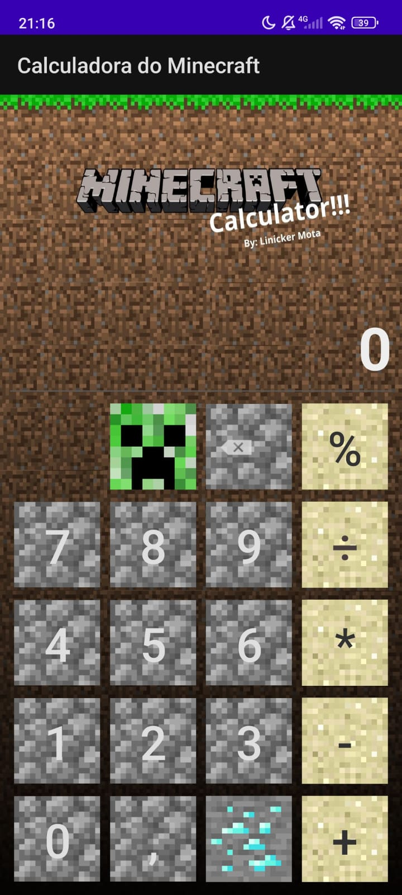

# Calculadora Minecraft

A Calculadora Minecraft é um projeto da disciplina de Desenvolvimento de Dispositivos Móveis, onde o objetivo foi criar uma calculadora com o tema de nossa escolha. Optei pelo Minecraft para descontrair e ser diferente dos demais colegas, unindo funcionalidade e elementos visuais do jogo.

## 🛠️ Construído com

Java
Android Studio Project

## ✒️ Autores

* **Línicker Ostroski Mota** 
